

# Юнит тестирование

Шириев Рустем Венерович - тех. лид. команды разработки

Газпромнефть - Цифровые решения

---

##  Слайд в котором я рассказываю, что у нас круто работать 😎

### Технологический режим 2.0

>комплексный инструмент оперативного управления фондом добывающих скважин, направленный на оптимизацию затрат на подъём скважинной продукции

>Программа ежедневного просмотра ВСЕХ скважин для анализа того, на сколько эффективнее можно качать нефть на них

---

### Пример информационной системы

#### Система бронирования коворкинг мест

  - позволяет сотрудникам просматривать карту свободных рабочих мест (столов, переговорных, зон коворкинга)
  - резервировать их на нужный период через мобильное приложение
  - Система автоматически проверяет конфликты по времени, учитывает загруженность офиса
  - После бронирования пользователь получает подтверждение
  - Администратор может управлять конфигурацией офиса
  - Система интегрирована с корпоративной системой пользователей для получения данных о пользователе
  - Система интегрирована с аналитической системой офиса для подсчёта использования рабочих мест за период времени

---

### Пример информационной системы

#### Система бронирования коворкинг мест

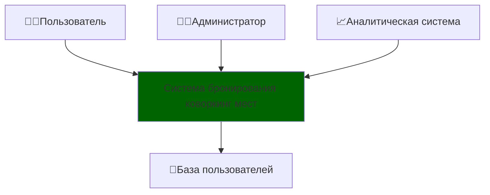

>Требуется внести правки в существующую систему

 - Что нужно сделать после разработки?
     - тут будет сказано что нужно тестировать
 - А вы что? Собираетесь ошибаться?
     - тут будет слайд почему люди ошибаются

---

### Ошибки при разработке ПО

1. Программирование — это процесс познания
2. Невозможно держать в голове всю систему целиком
3. Окружение непредсказуемо
4. Когнетивные искажения в коммуникациях
5. ~~Все мы люди~~

~~Хороший программист пишет код так чтобы~~ Правильные процессы в команде разработки выстроены так, чтобы

 - Ошибки было легко найти
 - Ошибки были обнаружены как можно раньше
 - Ошибки не приводили к катастрофе

---

### Система бронирования коворкинг мест

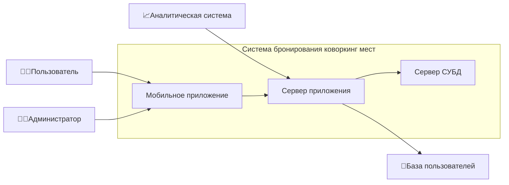

---

 - А как мы можем протестировать?
     - мобильное приложение
     - нужно тестовое окружение

---

### Система бронирования коворкинг мест

> Выделяем тестовое окружение

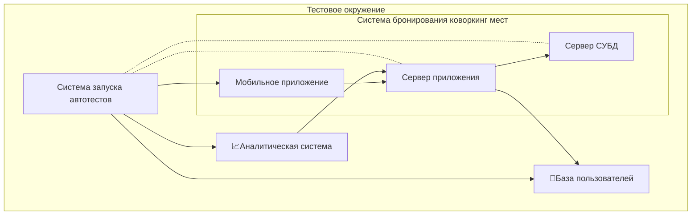

---

 - Выявление ошибок на этапе тестирование - дорогое удовольствие. Нужно это сдвигать
     - нужно автоматизировать тесты

---

### Автоматизированное тестирование ПО

> использует программные средства для выполнения тестов и проверки результатов выполнения, что помогает сократить время тестирования и упростить его процесс.
> 
> Википедия

---

### Система бронирования коворкинг мест

> добавляем авто тест

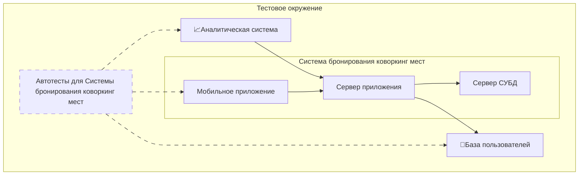

---

Автотесты интеграционные тоже очень дорогие
потому что
 - не все ситуации можно сымитировать
 - сложно выяснить где случилась поломка
 - тесты могут выполняться достаточно долго
 - тест достаточно сложно описать

---

### Система бронирования коворкинг мест

> Модули

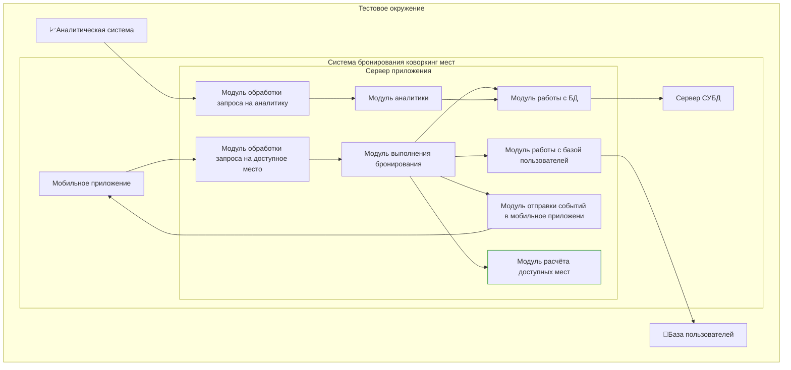

---

### Система бронирования коворкинг мест

> Божественный модуль

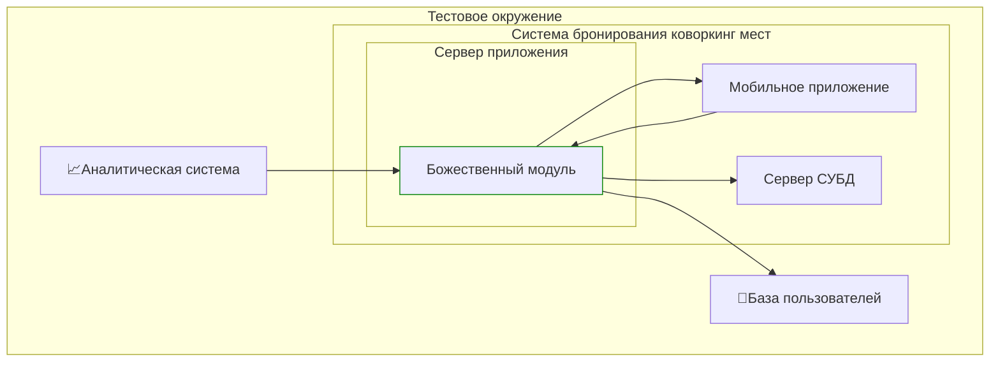

---

## Unit-тест

>Unit-тест - код, написанный разработчиком, который проверяет небольшой кусок функциональности тестируемого кода.

Обратимся к википедии:  

> **Модульное тестирование**, или **юнит-тестирование** (англ. unit testing) — процесс в программировании, позволяющий проверить на корректность отдельные модули исходного кода программы.  
>   
> Идея состоит в том, чтобы писать тесты для каждой нетривиальной функции или метода. Это позволяет достаточно быстро проверить, не привело ли очередное изменение кода к регрессии, то есть к появлению ошибок в уже оттестированных местах программы, а также облегчает обнаружение и устранение таких ошибок.

---

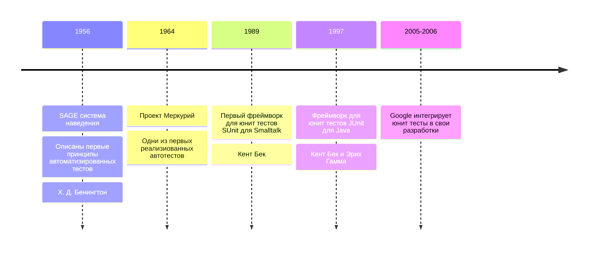

> Википедия

---

### Система бронирования коворкинг мест

> Модульный тест

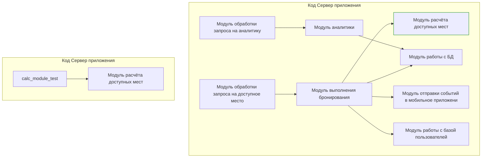

---

### Система бронирования коворкинг мест

> Модульный тест с моками

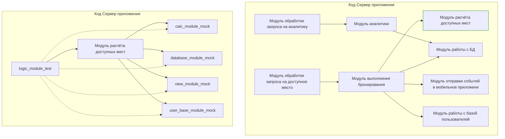

---

## Пирамида тестирования

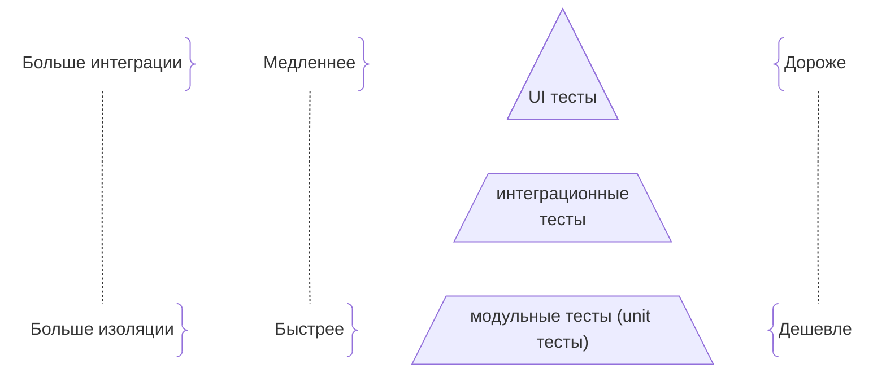

> Майк Кон описал в книге «Scrum: гибкая разработка ПО»

---

## Сколько реально юнит тестов

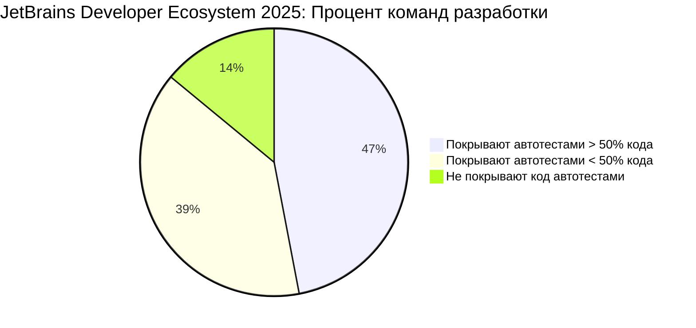

**Парадокс зрелости ([Covrig 2, ICST 2025](https://zenodo.org/records/14705473)):** в наиболее зрелых и надежных проектах наблюдается четкая тенденция: **количество строк кода, используемых для тестирования (TLOC), систематически превышает количество строк исполняемого кода (ELOC)**.

---

### Система бронирования коворкинг мест

> Модульный тест

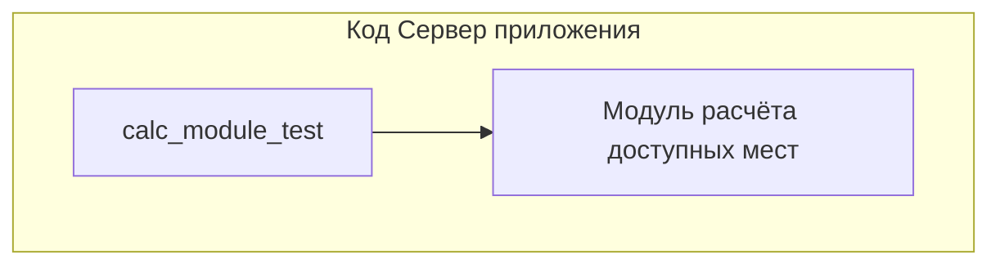

Описание метода:
- Проверка, можно ли занять место

 - Вход:
   - запрашиваемый интервал (start, end)
   - список уже занятых интервалов
   - минимальный промежуток между посещением
 - Выход: Возвращает true, если интервал свободен, не пересекается с занятыми, и до/после него есть зазор не меньше заданного

---

### Система бронирования коворкинг мест

> Модульный тест

---

### Свойства хорошего unit теста (FIRST)

#### F — Fast (Быстрые)

unit‑тесты должны выполняться очень быстро (миллисекунды или секунды). Это важно, потому что:

 - в проекте может быть тысячи unit‑тестов;
 - разработчики запускают их часто (при каждом изменении кода);
 - медленные unit‑тесты замедляют разработку и снижают мотивацию их запускать.

> Tim Ottinger and Brett Schuchert

---

### Свойства хорошего unit теста (FIRST)

#### I — Independent / Isolated (Независимые / Изолированные)

Каждый unit‑тест должен:

 - выполняться независимо от других;
 - не зависеть от порядка запуска;
 - настраивать собственное окружение и очищать его после выполнения;
 - не использовать глобальное или разделяемое состояние.

> Tim Ottinger and Brett Schuchert

---

### Свойства хорошего unit теста (FIRST)

#### R — Repeatable (Повторяемые)

unit‑тесты должны давать одинаковый результат при каждом запуске в одной и той же среде. На результат не должны влиять:

 - внешние факторы (сеть, база данных, файловая система);
 - дата/время;
 - случайные значения (если они не зафиксированы);
 - параллельное выполнение других тестов.

---

### Свойства хорошего unit теста (FIRST)

#### S — Self‑Validating (Самопроверяемые)

Тест должен сам определять, пройден он или нет. Для этого:

 - используются утверждения (assert, assertEquals и т. д.);
 - результат — чётко «прошёл» или «не прошёл»;
 - не требуется ручная проверка логов или вывода;
 - нет необходимости в дополнительной интерпретации результата.

---

### Свойства хорошего unit теста (FIRST)

#### T — Timely / Thorough (Своевременные / Тщательные)

Своевременность: тесты лучше писать до или во время написания кода (подход TDD — Test‑Driven Development). Так вы сразу проверяете, что код соответствует требованиям.

 - Тщательность: unit‑тесты должны покрывать:
    - основные сценарии использования;
    - граничные случаи (крайние значения, ошибки, исключения);
    - важные аспекты поведения кода (не только 100 % покрытие строк).

---

### Свойства хорошего unit теста (FIRST)

 - Если тест медленный → попробуйте убрать зависимости от БД/сети, использовать моки.

 - Если тесты зависят друг от друга → убедитесь, что каждый настраивает своё окружение.

 - Если тест иногда падает без причины → устраните внешние зависимости и случайные данные.

 - Если результат не очевиден → добавьте чёткие assert.

 - Если тестов мало или они пишутся после кода → попробуйте TDD: сначала тест, потом реализация.

---

## AAA (Arrange, Act, Assert) паттерн

Если посмотреть на юнит тест, то для большинства можно четко выделить 3 части кода:

 - **Arrange (настройка)** — в этом блоке кода мы настраиваем тестовое окружение тестируемого юнита;
 - **Act** — выполнение или вызов тестируемого сценария;
 - **Assert** — проверка того, что тестируемый вызов ведет себя определенным образом.

---

## Спасибо за внимание

Что почитать на тему:
 - Рой Ошероув - Искусство юнит-тестирования с примерами на JavaScript/С# (The Art of Unit Testing)
 - Владимир Хориков - Принципы юнит-тестирования
 - Кент Бек - Экстремальное программирование. Разработка через тестирование

---

 - слайд модулей системы +
 - слайд одного модуля +
 - слайд модульного тестирования +
 - слайд диаграммы системы с модульными тестами +
 - слайд пирамида тестирования +
 - слайд с примером теста
 - слайд с AAA + 
 - слайд с примером AAA 
 - слайд с качествами юнит тестов + 
 - слайд про запуск тестов и тест ранеры
 - слайд с итогами
 - слайд с TDD
 - слайд с моками
 - слайд с покрытием
 - слайд с литературой + 

---

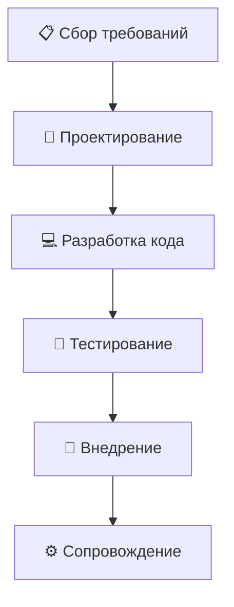

---

### Система бронирования

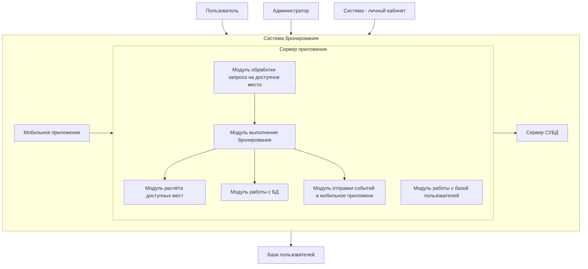

---

### Система бронирования

---

### Система бронирования

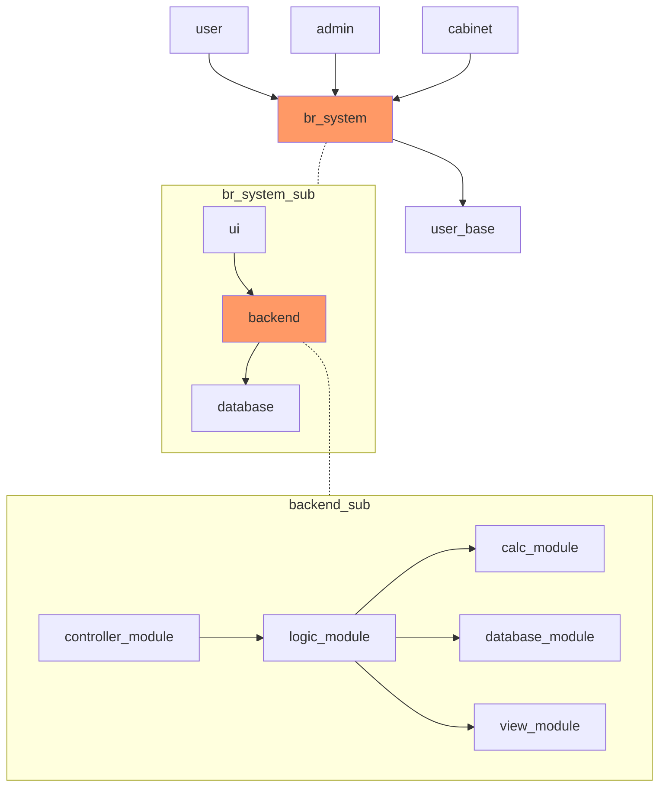

---

### Тех долг

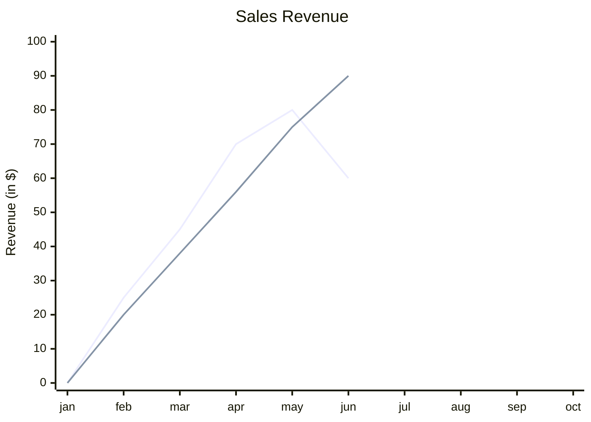

---