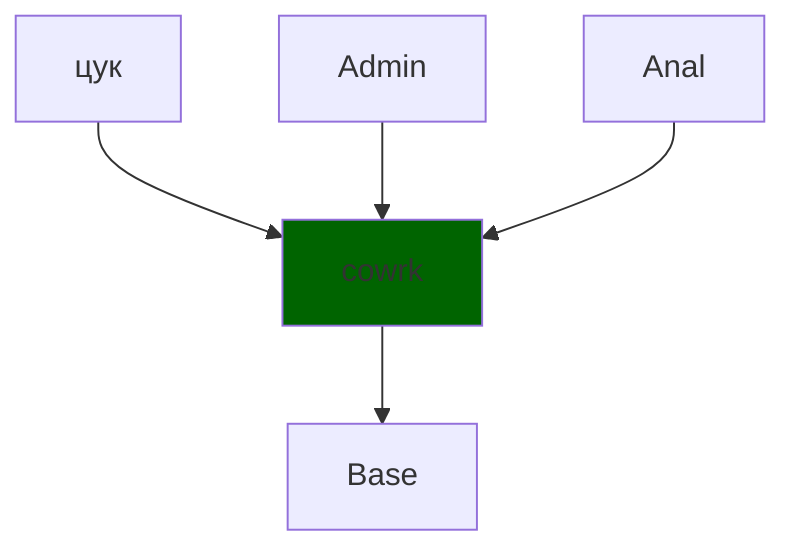

# Юнит тестирование

Шириев Рустем Венерович - тех. лид. команды разработки

Газпромнефть - Цифровые решения

---

##  Слайд в котором я рассказываю, что у нас круто работать

### Технологический режим 2.0

>комплексный инструмент оперативного управления фондом добывающих скважин, направленный на оптимизацию затрат на подъём скважинной продукции

>Программа ежедневного просмотра ВСЕХ скважин для анализа того, на сколько эффективнее можно качать нефть на них

---

### Пример информационной системы

#### Система бронирования коворкинг мест

  - позволяет сотрудникам просматривать карту свободных рабочих мест (столов, переговорных, зон коворкинга)
  - резервировать их на нужный период через мобильное приложение
  - Система автоматически проверяет конфликты по времени, учитывает загруженность офиса
  - После бронирования пользователь получает подтверждение
  - Администратор может управлять конфигурацией офиса
  - Система интегрирована с корпоративной системой пользователей для получения данных о пользователе
  - Система интегрирована с аналитической системой офиса для подсчёта использования рабочих мест за период времени

---

### Пример информационной системы

#### Система бронирования коворкинг мест

>Требуется внести правки в существующую систему

 - Что нужно сделать после разработки?
     - тут будет сказано что нужно тестировать
 - А вы что? Собираетесь ошибаться?
     - тут будет слайд почему люди ошибаются

---
